# JHeroes Tutorial

This document descbribes how to make a simple adventure with JHeroes engine.

## First thing first

I need to modify couple of places of code actually change game.

    commit 5265992ec678fde5502e4ad7a3c5265221a26748
    Author: Tuomo Untinen <tuomo.untinen@iki.fi>
    Date:   Tue Nov 24 22:37:56 2015 +0200
    
        Tutorial started and very minimum changes done for tutorial.
    
    diff --git a/src/org/jheroes/game/Game.java b/src/org/jheroes/game/Game.java
    index 153b70d..1e7d19d 100644
    --- a/src/org/jheroes/game/Game.java
    +++ b/src/org/jheroes/game/Game.java
    @@ -124,8 +124,8 @@ public class Game extends JFrame implements ActionListener {
       public static final int GAME_STATE_OPTIONS = 254;
       public static final int GAME_STATE_DEBUGMODE = 255;

First change the name and version
       
    -  public static final String GAME_TITLE = "Heroes of The Hawks Haven";
    -  public static final String GAME_VERSION ="1.0.0";
    +  public static final String GAME_TITLE = "JHeroes Tutorial";
    +  public static final String GAME_VERSION ="0.1.0Alpha";
      
       /**
        * Is running in debug mode
        
Next is to change the starting map
        
    @@ -2223,9 +2223,9 @@ public class Game extends JFrame implements ActionListener {
                 }
               }          
               party = new Party(newChar);
    -          party.setCurrentMapName(GameMaps.MAP_FILE_ADVENTURE_SCHOOL);
    +          party.setCurrentMapName(GameMaps.MAP_FILE_TUTORIAL);
               journal = new Journal();
    -          InputStream is = GameMaps.class.getResourceAsStream(GameMaps.MAPS_IN_JAR+GameMaps.MAP_FILE_ADVENTURE_SCHOOL);
    +          InputStream is = GameMaps.class.getResourceAsStream(GameMaps.MAPS_IN_JAR+GameMaps.MAP_FILE_TUTORIAL);
               DataInputStream dis = new DataInputStream(is);
               try {
                 map = new Map(dis);
    diff --git a/src/org/jheroes/game/GameMaps.java b/src/org/jheroes/game/GameMaps.java
    index 5cd673a..1dc5a9d 100644
    --- a/src/org/jheroes/game/GameMaps.java
    +++ b/src/org/jheroes/game/GameMaps.java
    @@ -46,29 +46,7 @@ import org.jheroes.map.character.Character;
     public class GameMaps {
     
Change the list of maps. Let's start with single map
     
       public final static String MAPS_IN_JAR = "/res/maps/";
    -  public final static String MAP_FILE_START = "start.map";
    -  public final static String MAP_FILE_ADVENTURE_SCHOOL = "AdventurerSchool.map"; // Village
    -  public final static String MAP_FILE_RAVENROW = "Ravenrow.map"; // Village
    -  public final static String MAP_FILE_RAVENROW_WELL = "RavenrowWell.map"; // Ruin&Cave
    -  public final static String MAP_FILE_RAVENWOODS= "Ravenwoods.map"; // Forest
    -  public final static String MAP_FILE_RAVENWOODS_CAVE= "RavenwoodsCave.map"; // Ruin&Cave
    -  public final static String MAP_FILE_ROAD_TO_HAWKS_HAVEN= "RoadToHawksHaven.map"; // Village
    -  public final static String MAP_FILE_OLD_RUINS= "OldRuins.map"; // Ruin&Cave
    -  public final static String MAP_FILE_SHADOW_WOODS= "ShadowWoods.map"; //Forest
    -  public final static String MAP_FILE_HOBGOBLIN_CAVES= "HobgoblinCaves.map"; // Ruin&Cave
    -  public final static String MAP_FILE_HAWKS_HAVEN_MARKET_DISTRICT = "HawksHavenMarketDistrict.map"; // City
    -  public final static String MAP_FILE_HAWKS_HAVEN_ARCANE_DISTRICT = "HawksHavenArcaneDistrict.map"; // City
    -  public final static String MAP_FILE_HAWKS_HAVEN_SEWERS = "HawksHavenSewers.map"; // Ruin&Cave
    -  public final static String MAP_FILE_MAGE_GUILD_CELLAR_LEVEL = "MageGuildCellarLevel.map"; // City
    -  public final static String MAP_FILE_HAWKS_HAVEN_CASTLE = "HawksHavenCastle.map"; // City
    -  public final static String MAP_FILE_ROAD_TO_CRYSTAL_LAKE = "RoadToCrystalLake.map"; // Village
    -  public final static String MAP_FILE_WOLFMEN_CAVE = "WolfmenCave.map"; // Ruin&Cave
    -  public final static String MAP_FILE_THE_ISLAND = "theisland.map"; // Forest
    -  public final static String MAP_FILE_CRYSTAL_LAKE = "CrystalLake.map"; // Forest
    -  public final static String MAP_FILE_CASTLE_OF_EVIL = "CastleOfEvil.map"; // Ruin&Cave
    -  public final static String MAP_FILE_ROAD_TO_CLOUDTOP = "RoadToCloudTop.map"; // Village
    -  public final static String MAP_FILE_CLOUDTOP = "CloudTop.map"; // City
    -  public final static String MAP_FILE_DEEPER_SHADOWWOODS = "DeeperShadowWoods.map"; // Forest
    +  public final static String MAP_FILE_TUTORIAL = "tutorial.map";
       
       public final static String PARTY_DATA_FILE = "party.dat";
       public final static String DEBUG_DATA_FILE = "debug.dat";
    @@ -77,16 +55,7 @@ public class GameMaps {
       
       public final static String CHARACTER_LIST_FILE = "/res/characterlist.res";
       
    -  private final static String[] GAMEMAPS = {MAP_FILE_ADVENTURE_SCHOOL,
    -    MAP_FILE_RAVENROW,MAP_FILE_RAVENROW_WELL,MAP_FILE_RAVENWOODS,
    -    MAP_FILE_RAVENWOODS_CAVE,MAP_FILE_ROAD_TO_HAWKS_HAVEN,
    -    MAP_FILE_OLD_RUINS,MAP_FILE_SHADOW_WOODS,MAP_FILE_HOBGOBLIN_CAVES,
    -    MAP_FILE_HAWKS_HAVEN_MARKET_DISTRICT,MAP_FILE_HAWKS_HAVEN_ARCANE_DISTRICT,
    -    MAP_FILE_HAWKS_HAVEN_SEWERS,MAP_FILE_MAGE_GUILD_CELLAR_LEVEL,
    -    MAP_FILE_HAWKS_HAVEN_CASTLE,MAP_FILE_ROAD_TO_CRYSTAL_LAKE,
    -    MAP_FILE_WOLFMEN_CAVE,MAP_FILE_THE_ISLAND,MAP_FILE_CRYSTAL_LAKE,
    -    MAP_FILE_CASTLE_OF_EVIL,MAP_FILE_ROAD_TO_CLOUDTOP,MAP_FILE_CLOUDTOP,
    -    MAP_FILE_DEEPER_SHADOWWOODS};
    +  private final static String[] GAMEMAPS = {MAP_FILE_TUTORIAL};
       
       private static volatile int progress;
       
    diff --git a/src/org/jheroes/game/GameTalk.java b/src/org/jheroes/game/GameTalk.java
    index c5536bd..1e46f9a 100644
    --- a/src/org/jheroes/game/GameTalk.java
    +++ b/src/org/jheroes/game/GameTalk.java
    @@ -633,34 +633,14 @@ public class GameTalk extends GamePanel {
             if (index != -1) {

At this moment new party members are not know so just adding very generic one whom
starts always at level 0.
             
               party.setPartyChar(index, newMember);
               //Set base roles for joining characters
    -          if (newMember.getLongName().equalsIgnoreCase("Elnora Tanolian")) {
    -            party.setRolesForCharacter(index, 0, 2, 0);
    -            newMember.setExperience(0);
    -          }
    -          if (newMember.getLongName().equalsIgnoreCase("Crulamin Tigersoul")) {
    -            party.setRolesForCharacter(index, 0, 0, 2);
    -            newMember.setExperience(0);
    -          }
    +          party.setRolesForCharacter(index, 0, 0, 0);
    +          newMember.setExperience(0);
    +          /* Keeping one as example for later use
               if (newMember.getLongName().equalsIgnoreCase("Werdinor Blackbone")) {
                 party.setRolesForCharacter(index, 0, 0, 4);
                 newMember.setExperience(4500);
                 newMember.setLevel(4);
    -          }
    -          if (newMember.getLongName().equalsIgnoreCase("Brunor Whitebeard")) {
    -            party.setRolesForCharacter(index, 4, 0, 0);
    -            newMember.setExperience(10000);
    -            newMember.setLevel(6);
    -          }
    -          if (newMember.getLongName().equalsIgnoreCase("Beatrice Silvershield")) {
    -            party.setRolesForCharacter(index, 3, 0, 0);
    -            newMember.setExperience(4500);
    -            newMember.setLevel(4);
    -          }
    -          if (newMember.getLongName().equalsIgnoreCase("Nehess Battlehawk")) {
    -            party.setRolesForCharacter(index, 0, 4, 0);
    -            newMember.setExperience(10000);
    -            newMember.setLevel(6);
    -          }
    +          }*/
               removeNPC = true;
             }
             break;
    diff --git a/src/org/jheroes/game/storyscreen/StartStory.java b/src/org/jheroes/game/storyscreen/StartStory.java
    index 31d2c90..abe5a54 100644
    --- a/src/org/jheroes/game/storyscreen/StartStory.java
    +++ b/src/org/jheroes/game/storyscreen/StartStory.java

Let's do new starting intro, but keeping the end and lose screen as it is for a while.
    
    @@ -53,17 +53,12 @@ public class StartStory extends StoryScreen {
         switch (index) {
         case 0: {
           screenData.setImage(GuiStatics.loadImage(Screens.START_SCREEN_1));
    -      screenData.setText("Empire of Hawks Haven is in great danger. Emperor is sick" +
    -         " and there is no heir for the throne. Rebels are also gathering to overthrow" +
    -         " empire and his reign. Dangerous beasts and monsters are living in the Empire...");
    +      screenData.setText("This tutorial for JHeroes! JHeroes need tutorial story...");
           break;
         }
         case 1: {
           screenData.setImage(GuiStatics.loadImage(Screens.CROWN_IMAGE));
    -      screenData.setText("Fear not since there is new hero to proctect the crown. " +
    -      "You are about the graduate from Nerisella Songsteel School of Adventurers. " +
    -      "You just need to decide what you have learned while studying. " +
    -      "Who know what kind of adventurers are waiting for you...");
    +      screenData.setText("New adventurer is arriving and adventure begins...");
           break;
         }
         default: {
     
## Let's create the tutorial.map

Start up the Map Editor. Click File->New Map

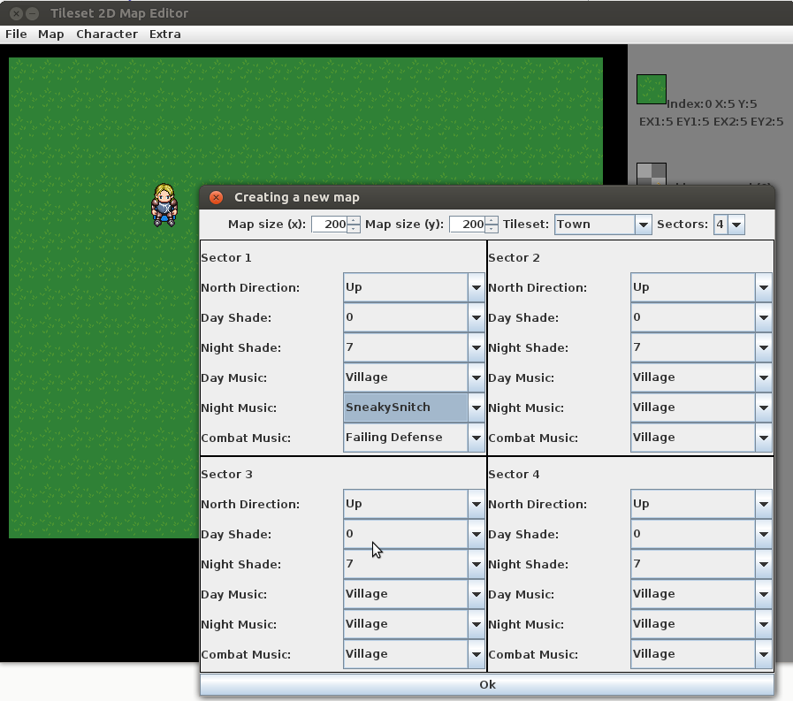

New map Settings should look something like above.
Map size from 32x32 to 256x256 tiles. 200x200 is already quite big map. Let's
use that one. Tileset is which tileset is used for this map. Let's select Town.
Sectors means how many different sectors map can have. Options are 1, 2 or 4.
Sectors are clever way to map transitions inside same map. For example Sector 1
could be outside part of the map. Sector 2 could inside of the normal house.
Sector 3 could inside of shops. Sector 4 could inside of haunted house.

Each sector can have their own musics, shading and direction where the north
is. Usually north direction options are either up or down. Shade is value between
0 and 7. 0 Is being the brightest and 7 is the darkest shading. So usually inside
of buildings could be slightly darker than outside. If place is haunter or otherwise
scare it could be darker. If you do not want to have day and light changes in simply
put day and night shade into same value. Same thing could be done for night and day music.
Music changes also in editor, expect you cannot hear the combat music. But look for
good combat music in day music and then change correct one the combat.

So let's do 200x200 tile map and set up the first sectors. After new map has been
created sector settings can be changed but not the size, tileset or number of sectors.

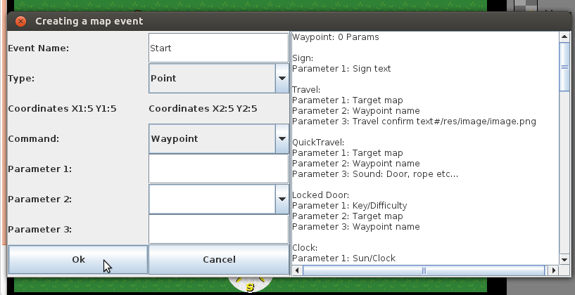

There needs to be starting event for player. This is very easy to create.
Simple add new event by pressing 1 and 2. Setting the event size. 1 for upper-left
corner and 2 for botton-right. The press E to add new event. Just add name Start
and keep the type as point and command as waypoint. Now if Click OK you should
see blue event on the map.

This is all what is needed for simplest map. Save the map to following folder:

    JHeroes/src/res/maps/tutorial.map
    
If you are using Eclipse remember to refresh your project before actually running
the JHeroes since Eclipse needs to copy new map to bin folder before running.

### Let's make a road

Select road tile with + or - from numpad, * or / numpad or insert and delete. Select
index between 15 and 28. Any of these tiles can be used to make a road. You can use
H key to place 2x2 area of same tiles and B to place 3x3 area of same tiles. When you
have finished one screen you can smooth with S key. Smoothing affect usually walls and
floor tiles. Sometimes you have to be careful with smoothing since smooth can
also break some tiles if you have manually placed those. That's why smoothing only 
affects tiles which are currently visible.

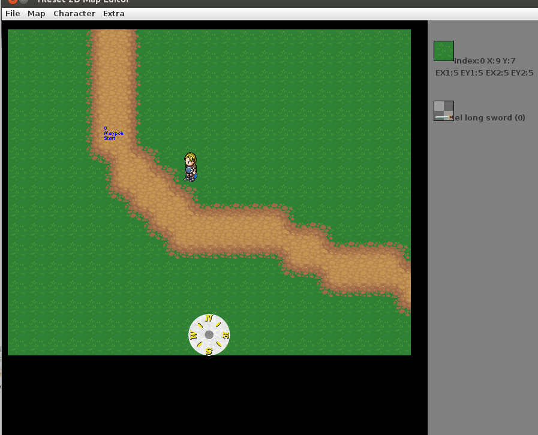

Let's add woods next the roads. First let's pick tile number 110. Place it one
tile away from road. Then select tile number 111 and place it right from previous one.
Move one down and place there tile number 112 and finally move one left and place tile 113.
Then move to upper-left corner of woods and press 3 and then lower-right corner and
press 4. These are now corners where copying is done. Now pressing P will paste
this buffer around.

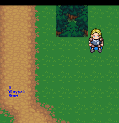

Then place woods around the road using P key.
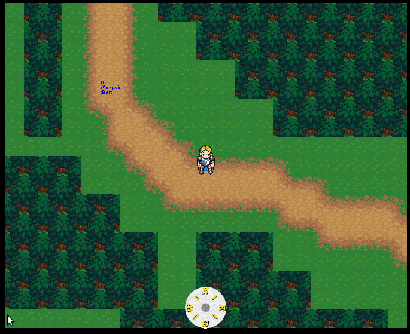

And finally smooth manually woods to make them look pretty.
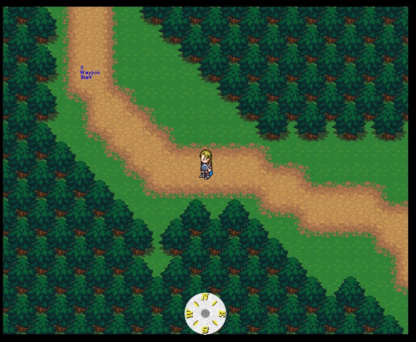

### Let's make a house

Pick a good looking position from next to the road.
Place couple wall tiles (Tile index 251 for example) for walls. B Key is faster.
Then pick a roof you like (Tile index 278 for example) for roof. Also B key is faster.

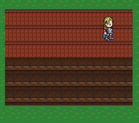

When house looks about size you wanted just press S and smoothing is done.

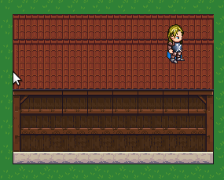

Then do final touches manually. You can put the road next to the door.
Add the door(294-297), windows(298 and 299) and maybe chimney(300).
You can move faster to next complete tileseries using Home and End keys or
from numpad press / or *. Eaxmple you are looking door 294 and you press Home
it moves to 296 skipping the bottom part of door since that is belonging to first
door series.

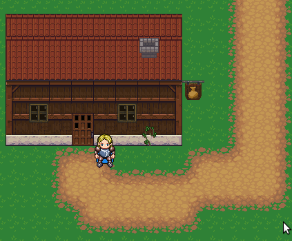

#### Create a sign

Creating a sign is easy. Move to sign tile and press 1 and 2( Makes the event rectangle)
and press E to create Event. Pick command for sign and parameter 1 is used as
sign's text. Event editor has built in help on right hand side. When everything
is done just press OK.

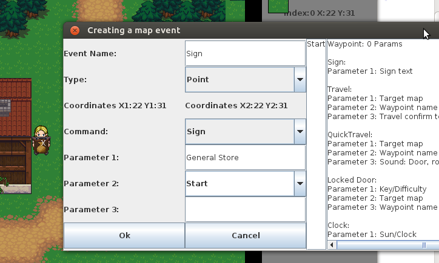

Sign is shown as white text on Map Editor. Events have following color coding:
 * White is for information events like Clock, Look info, signs
 * Blue is for waypoints
 * Green is for someone or something is going to say something.
 * Magenta is for encounters
 * Cyan is for Travel events
 * Red is for locked doors
 * Yellow is for events that modify map or play sound effects

#### Create interior for the house

Let's do next an interior for the house.
First let's do a way point just outside of the door. I used 3x2 regions
for traveling waypoints. These should be contain at least 4 tiles
that maximum size of party can fit into tiles. Couple of extra tiles
won't hurt if there is an NPC nearby.

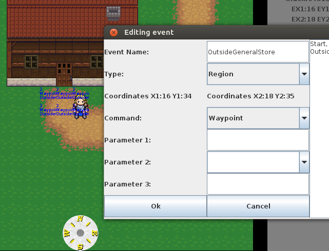

EventName must be unique so it can be used as a waypoint. Type is region and
command is waypoint. Remember event is created by using keys 1 and 2 to make
the region and E key is used to edit the event.

Next thing is select which sector is for interior. Now let's pick sector 2.

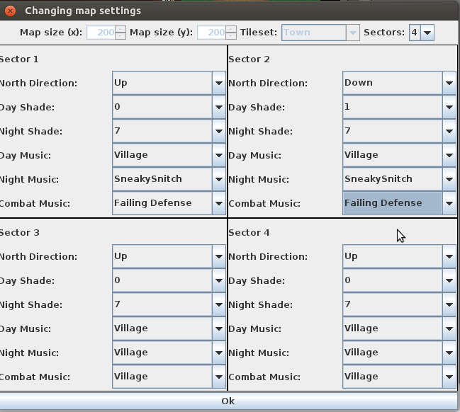

Sector 2 has North direction up so it is 180 degreess compared to sector 1.
I selected one darker day shade for sector two just making it a bit darker.
Musics are just the same as sector one.

Next thing is to move to sector 2. Move to X coordinate 100 and Y coordinate 35.
Select tile 318(It is the center piece of wooden wall top, but looks black). Then
press C key to fill whole sector with that tile. Then select a floor tile(For example 307)
and Make 8x4 floor couple of tiles from the left border of sector. Then pick
a wall tile(251 for example). Make a 8x3 wall. And finally press S to smooth.
Try doing smooth so that sector border is in visible in screen since smoothing
may try do edging also for border. You should get something like this:

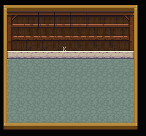

Next thing is to add door and couple furnitures. General store could look something
like this:

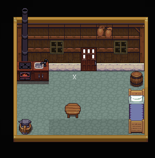

After this let's add way point to inside. Again 3x2 region with unique name.

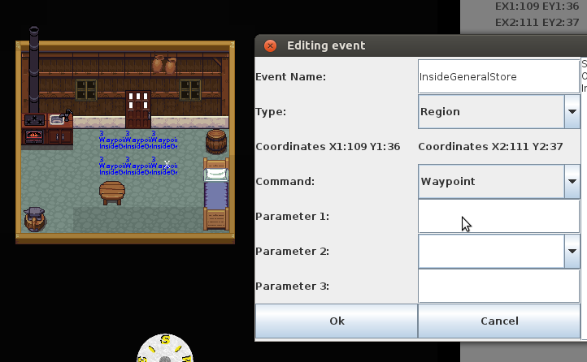

Then next thing to add is door functionality.

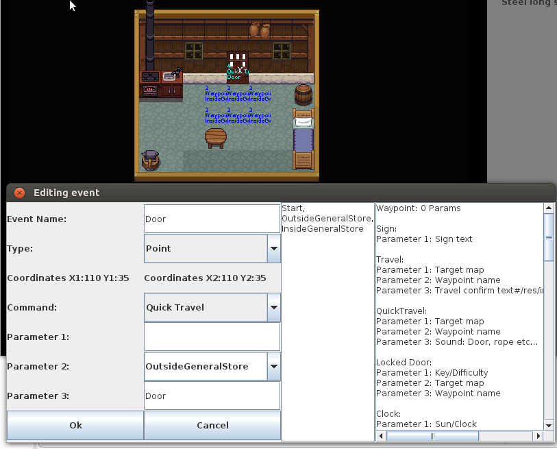

So make on tile event on top door tile.(Marked with cyan color on map)
Name can be anything and does not need to be unique in doors.
Command is now quick travel. Quick travel is travel event which does not
ask confirmation about the travel it happens immediately when player enters
on the tile.

* Parameter1 could contain the target map name where the travel is going to happen.
It can be empty if travelling inside the same map. 

* Parameter2 is the target waypoint name. There is a dropdown menu where target
waypoint can be selected or just type the waypoint name. Also middle column lists
the waypoints on this map.

* Parameter3 is the possible sound effect name. Doors usually have door. If
quick travel is just a door way it can be empty. List of possible sounds
can be found from source code (See SoundPlayer.java method playSoundBySoundName())
After this everything should be done. 

You can test travel events inside same map just moving on top of event and 
press Q button. It should take you just outside of the general store. Next thing
 is to do similar event on outside door just change the waypoint to insideGeneralStore.

### Addings sounds

Adding sounds is very important for atmosphere of the game. Adding sounds
is actually pretty easy. All you need to add event. It can be single tile or
region. If any of sound event tiles is drawn on screen there sound might be played.

So event command needs to be "Play sound". Parameter1 is sound name. List of possible sounds
can be found from source code (See SoundPlayer.java method playSoundBySoundName())
Parameter2 is when sounds is played. There are couple of options:
 
 * NN or a number between 1-99. This means that each time tile with play sound 
 effect is draw there is a possibility play the sound. There is randomize number up to
 set number and if result is zero then sound effect is played. So bigger the number
 less often sound is player
 * Loop, sound is looped
 * Day, sound is looped on day time
 * Night, sound is looped on night time
 * Day#NN, Sound is played by similar chance as in NN but only day time.
 * Night#NN, Sound is played by similar chance as in NN but only night time.
 
 Example of playing cricket sound on night:
 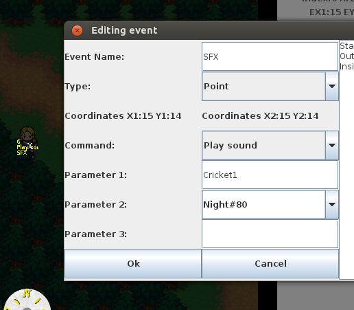
 
 Another example of fireplace sound effect:
 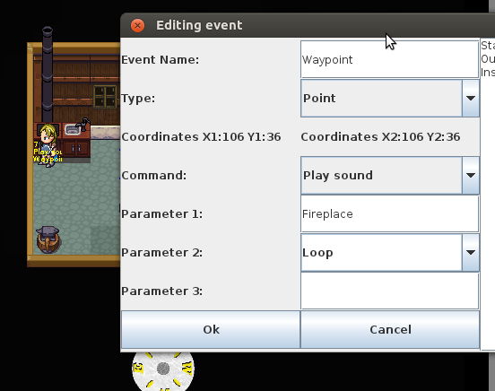
 