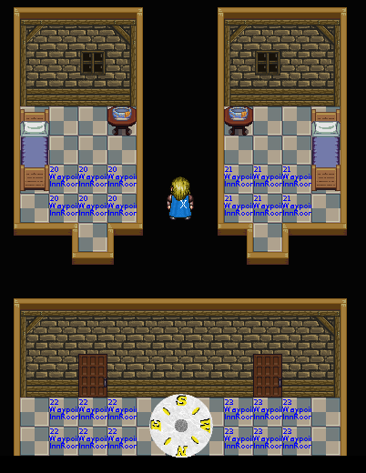
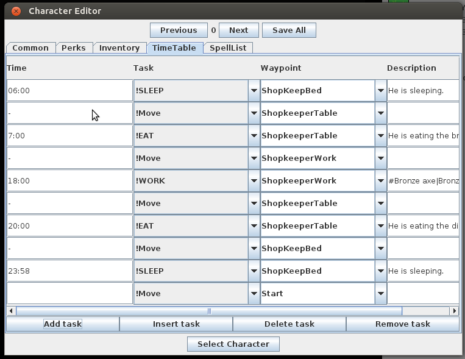

# JHeroes Tutorial

This document descbribes how to make a simple adventure with JHeroes engine.
All the changes are done already in tutorial branch.

## First thing first

I need to modify couple of places of code actually change game.

    commit 5265992ec678fde5502e4ad7a3c5265221a26748
    Author: Tuomo Untinen <tuomo.untinen@iki.fi>
    Date:   Tue Nov 24 22:37:56 2015 +0200
    
        Tutorial started and very minimum changes done for tutorial.
    
    diff --git a/src/org/jheroes/game/Game.java b/src/org/jheroes/game/Game.java
    index 153b70d..1e7d19d 100644
    --- a/src/org/jheroes/game/Game.java
    +++ b/src/org/jheroes/game/Game.java
    @@ -124,8 +124,8 @@ public class Game extends JFrame implements ActionListener {
       public static final int GAME_STATE_OPTIONS = 254;
       public static final int GAME_STATE_DEBUGMODE = 255;

First change the name and version
       
    -  public static final String GAME_TITLE = "Heroes of The Hawks Haven";
    -  public static final String GAME_VERSION ="1.0.0";
    +  public static final String GAME_TITLE = "JHeroes Tutorial";
    +  public static final String GAME_VERSION ="0.1.0Alpha";
      
       /**
        * Is running in debug mode
        
Next is to change the starting map
        
    @@ -2223,9 +2223,9 @@ public class Game extends JFrame implements ActionListener {
                 }
               }          
               party = new Party(newChar);
    -          party.setCurrentMapName(GameMaps.MAP_FILE_ADVENTURE_SCHOOL);
    +          party.setCurrentMapName(GameMaps.MAP_FILE_TUTORIAL);
               journal = new Journal();
    -          InputStream is = GameMaps.class.getResourceAsStream(GameMaps.MAPS_IN_JAR+GameMaps.MAP_FILE_ADVENTURE_SCHOOL);
    +          InputStream is = GameMaps.class.getResourceAsStream(GameMaps.MAPS_IN_JAR+GameMaps.MAP_FILE_TUTORIAL);
               DataInputStream dis = new DataInputStream(is);
               try {
                 map = new Map(dis);
    diff --git a/src/org/jheroes/game/GameMaps.java b/src/org/jheroes/game/GameMaps.java
    index 5cd673a..1dc5a9d 100644
    --- a/src/org/jheroes/game/GameMaps.java
    +++ b/src/org/jheroes/game/GameMaps.java
    @@ -46,29 +46,7 @@ import org.jheroes.map.character.Character;
     public class GameMaps {
     
Change the list of maps. Let's start with single map
     
       public final static String MAPS_IN_JAR = "/res/maps/";
    -  public final static String MAP_FILE_START = "start.map";
    -  public final static String MAP_FILE_ADVENTURE_SCHOOL = "AdventurerSchool.map"; // Village
    -  public final static String MAP_FILE_RAVENROW = "Ravenrow.map"; // Village
    -  public final static String MAP_FILE_RAVENROW_WELL = "RavenrowWell.map"; // Ruin&Cave
    -  public final static String MAP_FILE_RAVENWOODS= "Ravenwoods.map"; // Forest
    -  public final static String MAP_FILE_RAVENWOODS_CAVE= "RavenwoodsCave.map"; // Ruin&Cave
    -  public final static String MAP_FILE_ROAD_TO_HAWKS_HAVEN= "RoadToHawksHaven.map"; // Village
    -  public final static String MAP_FILE_OLD_RUINS= "OldRuins.map"; // Ruin&Cave
    -  public final static String MAP_FILE_SHADOW_WOODS= "ShadowWoods.map"; //Forest
    -  public final static String MAP_FILE_HOBGOBLIN_CAVES= "HobgoblinCaves.map"; // Ruin&Cave
    -  public final static String MAP_FILE_HAWKS_HAVEN_MARKET_DISTRICT = "HawksHavenMarketDistrict.map"; // City
    -  public final static String MAP_FILE_HAWKS_HAVEN_ARCANE_DISTRICT = "HawksHavenArcaneDistrict.map"; // City
    -  public final static String MAP_FILE_HAWKS_HAVEN_SEWERS = "HawksHavenSewers.map"; // Ruin&Cave
    -  public final static String MAP_FILE_MAGE_GUILD_CELLAR_LEVEL = "MageGuildCellarLevel.map"; // City
    -  public final static String MAP_FILE_HAWKS_HAVEN_CASTLE = "HawksHavenCastle.map"; // City
    -  public final static String MAP_FILE_ROAD_TO_CRYSTAL_LAKE = "RoadToCrystalLake.map"; // Village
    -  public final static String MAP_FILE_WOLFMEN_CAVE = "WolfmenCave.map"; // Ruin&Cave
    -  public final static String MAP_FILE_THE_ISLAND = "theisland.map"; // Forest
    -  public final static String MAP_FILE_CRYSTAL_LAKE = "CrystalLake.map"; // Forest
    -  public final static String MAP_FILE_CASTLE_OF_EVIL = "CastleOfEvil.map"; // Ruin&Cave
    -  public final static String MAP_FILE_ROAD_TO_CLOUDTOP = "RoadToCloudTop.map"; // Village
    -  public final static String MAP_FILE_CLOUDTOP = "CloudTop.map"; // City
    -  public final static String MAP_FILE_DEEPER_SHADOWWOODS = "DeeperShadowWoods.map"; // Forest
    +  public final static String MAP_FILE_TUTORIAL = "tutorial.map";
       
       public final static String PARTY_DATA_FILE = "party.dat";
       public final static String DEBUG_DATA_FILE = "debug.dat";
    @@ -77,16 +55,7 @@ public class GameMaps {
       
       public final static String CHARACTER_LIST_FILE = "/res/characterlist.res";
       
    -  private final static String[] GAMEMAPS = {MAP_FILE_ADVENTURE_SCHOOL,
    -    MAP_FILE_RAVENROW,MAP_FILE_RAVENROW_WELL,MAP_FILE_RAVENWOODS,
    -    MAP_FILE_RAVENWOODS_CAVE,MAP_FILE_ROAD_TO_HAWKS_HAVEN,
    -    MAP_FILE_OLD_RUINS,MAP_FILE_SHADOW_WOODS,MAP_FILE_HOBGOBLIN_CAVES,
    -    MAP_FILE_HAWKS_HAVEN_MARKET_DISTRICT,MAP_FILE_HAWKS_HAVEN_ARCANE_DISTRICT,
    -    MAP_FILE_HAWKS_HAVEN_SEWERS,MAP_FILE_MAGE_GUILD_CELLAR_LEVEL,
    -    MAP_FILE_HAWKS_HAVEN_CASTLE,MAP_FILE_ROAD_TO_CRYSTAL_LAKE,
    -    MAP_FILE_WOLFMEN_CAVE,MAP_FILE_THE_ISLAND,MAP_FILE_CRYSTAL_LAKE,
    -    MAP_FILE_CASTLE_OF_EVIL,MAP_FILE_ROAD_TO_CLOUDTOP,MAP_FILE_CLOUDTOP,
    -    MAP_FILE_DEEPER_SHADOWWOODS};
    +  private final static String[] GAMEMAPS = {MAP_FILE_TUTORIAL};
       
       private static volatile int progress;
       
    diff --git a/src/org/jheroes/game/GameTalk.java b/src/org/jheroes/game/GameTalk.java
    index c5536bd..1e46f9a 100644
    --- a/src/org/jheroes/game/GameTalk.java
    +++ b/src/org/jheroes/game/GameTalk.java
    @@ -633,34 +633,14 @@ public class GameTalk extends GamePanel {
             if (index != -1) {

At this moment new party members are not know so just adding very generic one whom
starts always at level 0.
             
               party.setPartyChar(index, newMember);
               //Set base roles for joining characters
    -          if (newMember.getLongName().equalsIgnoreCase("Elnora Tanolian")) {
    -            party.setRolesForCharacter(index, 0, 2, 0);
    -            newMember.setExperience(0);
    -          }
    -          if (newMember.getLongName().equalsIgnoreCase("Crulamin Tigersoul")) {
    -            party.setRolesForCharacter(index, 0, 0, 2);
    -            newMember.setExperience(0);
    -          }
    +          party.setRolesForCharacter(index, 0, 0, 0);
    +          newMember.setExperience(0);
    +          /* Keeping one as example for later use
               if (newMember.getLongName().equalsIgnoreCase("Werdinor Blackbone")) {
                 party.setRolesForCharacter(index, 0, 0, 4);
                 newMember.setExperience(4500);
                 newMember.setLevel(4);
    -          }
    -          if (newMember.getLongName().equalsIgnoreCase("Brunor Whitebeard")) {
    -            party.setRolesForCharacter(index, 4, 0, 0);
    -            newMember.setExperience(10000);
    -            newMember.setLevel(6);
    -          }
    -          if (newMember.getLongName().equalsIgnoreCase("Beatrice Silvershield")) {
    -            party.setRolesForCharacter(index, 3, 0, 0);
    -            newMember.setExperience(4500);
    -            newMember.setLevel(4);
    -          }
    -          if (newMember.getLongName().equalsIgnoreCase("Nehess Battlehawk")) {
    -            party.setRolesForCharacter(index, 0, 4, 0);
    -            newMember.setExperience(10000);
    -            newMember.setLevel(6);
    -          }
    +          }*/
               removeNPC = true;
             }
             break;
    diff --git a/src/org/jheroes/game/storyscreen/StartStory.java b/src/org/jheroes/game/storyscreen/StartStory.java
    index 31d2c90..abe5a54 100644
    --- a/src/org/jheroes/game/storyscreen/StartStory.java
    +++ b/src/org/jheroes/game/storyscreen/StartStory.java

Let's do new starting intro, but keeping the end and lose screen as it is for a while.
    
    @@ -53,17 +53,12 @@ public class StartStory extends StoryScreen {
         switch (index) {
         case 0: {
           screenData.setImage(GuiStatics.loadImage(Screens.START_SCREEN_1));
    -      screenData.setText("Empire of Hawks Haven is in great danger. Emperor is sick" +
    -         " and there is no heir for the throne. Rebels are also gathering to overthrow" +
    -         " empire and his reign. Dangerous beasts and monsters are living in the Empire...");
    +      screenData.setText("This tutorial for JHeroes! JHeroes need tutorial story...");
           break;
         }
         case 1: {
           screenData.setImage(GuiStatics.loadImage(Screens.CROWN_IMAGE));
    -      screenData.setText("Fear not since there is new hero to proctect the crown. " +
    -      "You are about the graduate from Nerisella Songsteel School of Adventurers. " +
    -      "You just need to decide what you have learned while studying. " +
    -      "Who know what kind of adventurers are waiting for you...");
    +      screenData.setText("New adventurer is arriving and adventure begins...");
           break;
         }
         default: {
     
## The Map Editor

Map Editor in JHeroes is the tool to make new maps, talks and characters.
Editor has couple of modes:

 * Map editing mode which is the common mode when editing the maps itself.
 * Character Editor mode, this editor allows to create new characters
 which can be placed on the map.
 * Talk Editor, this editor allows to make talks that are used by characters
 made in character editor.
 
### Map Editor keys

In map editing mode almost every thing is done with keyboard.
Here is the list of keys:

*  Arrow keys: Move the cursor/Character

* 1: Set current position as upperleft corner of event
* 2: Set current position as lowerright corner of event
* E: Edit/Add new event. 
* Q: Quick travel, Useful check that Door event really do work

* 3: Set current position as upperleft corner of copy tilearray 
* 4: Set current position as lowerright corner of copy tilearray
* P: Paste copy tilearray. Note copied data is not copied into buffer but directly taking copy from the map.

* PageUp: Go to next item 
* PageDown: Go to previous item
* I: Place item to map
* Backspace: Remove all the items from current map coordinates. Remove all the objects, decorations and top
from current coordinates. 

* Insert or Numpad +: Go to next tile
* Delete or Numpad -: Go to previous tile
* Home or Numpad *: Go to next tile series(For example walls that belong same series)
* End or Numpad /: Go to previous tile series(For example walls that belong same series)
* Space: Place tile into it's default layer/position  in tileset.
* D: Place tile into decoration layer/position.
* T: Place tile into top layer/position.
* O: Place tile into object layer/position.

* F: Copy all 4 layers into 2x2 buffer. Current position is upperleft corner.
* J: Paste all 4 layer from 2x2 buffer. Current position is upperleft corner.
* G: Get the tile from most top of layers in current position.
* H: Place 2x2 tiles into it's default layer/position in tileset. 
* B: Place 3x3 tiles into it's default layer/position in tileset.
 
* C: Fill whole sector with selected tile. Only if tile default position is floor or wall.

* S: Smooth visible part of the map. Smooth walls and floor which belong in same series.
* V: Recalculate lighting. This should be done at least before saving the map.
* N: Toggle between night and day lighting.

## Let's create the tutorial.map

Start up the Map Editor. Click File->New Map

New map Settings should look something like above.
Map size from 32x32 to 256x256 tiles. 200x200 is already quite big map. Let's
use that one. Tileset is which tileset is used for this map. Let's select Town.
Sectors means how many different sectors map can have. Options are 1, 2 or 4.
Sectors are clever way to map transitions inside same map. For example Sector 1
could be outside part of the map. Sector 2 could inside of the normal house.
Sector 3 could inside of shops. Sector 4 could inside of haunted house.

Each sector can have their own musics, shading and direction where the north
is. Usually north direction options are either up or down. Shade is value between
0 and 7. 0 Is being the brightest and 7 is the darkest shading. So usually inside
of buildings could be slightly darker than outside. If place is haunter or otherwise
scare it could be darker. If you do not want to have day and light changes in simply
put day and night shade into same value. Same thing could be done for night and day music.
Music changes also in editor, expect you cannot hear the combat music. But look for
good combat music in day music and then change correct one the combat.

So let's do 200x200 tile map and set up the first sectors. After new map has been
created sector settings can be changed but not the size, tileset or number of sectors.

There needs to be starting event for player. This is very easy to create.
Simple add new event by pressing 1 and 2. Setting the event size. 1 for upper-left
corner and 2 for botton-right. The press E to add new event. Just add name Start
and keep the type as point and command as waypoint. Now if Click OK you should
see blue event on the map.

This is all what is needed for simplest map. Save the map to following folder:

    JHeroes/src/res/maps/tutorial.map
    
If you are using Eclipse remember to refresh your project before actually running
the JHeroes since Eclipse needs to copy new map to bin folder before running.

### Let's make a road

Select road tile with + or - from numpad, * or / numpad or insert and delete. Select
index between 15 and 28. Any of these tiles can be used to make a road. You can use
H key to place 2x2 area of same tiles and B to place 3x3 area of same tiles. When you
have finished one screen you can smooth with S key. Smoothing affect usually walls and
floor tiles. Sometimes you have to be careful with smoothing since smooth can
also break some tiles if you have manually placed those. That's why smoothing only 
affects tiles which are currently visible.

Let's add woods next the roads. First let's pick tile number 110. Place it one
tile away from road. Then select tile number 111 and place it right from previous one.
Move one down and place there tile number 112 and finally move one left and place tile 113.
Then move to upper-left corner of woods and press 3 and then lower-right corner and
press 4. These are now corners where copying is done. Now pressing P will paste
this buffer around.

Then place woods around the road using P key.

And finally smooth manually woods to make them look pretty.

### Let's make a house

Pick a good looking position from next to the road.
Place couple wall tiles (Tile index 251 for example) for walls. B Key is faster.
Then pick a roof you like (Tile index 278 for example) for roof. Also B key is faster.

When house looks about size you wanted just press S and smoothing is done.

Then do final touches manually. You can put the road next to the door.
Add the door(294-297), windows(298 and 299) and maybe chimney(300).
You can move faster to next complete tileseries using Home and End keys or
from numpad press / or *. Eaxmple you are looking door 294 and you press Home
it moves to 296 skipping the bottom part of door since that is belonging to first
door series.

#### Create a sign

Creating a sign is easy. Move to sign tile and press 1 and 2( Makes the event rectangle)
and press E to create Event. Pick command for sign and parameter 1 is used as
sign's text. Event editor has built in help on right hand side. When everything
is done just press OK.

Sign is shown as white text on Map Editor. Events have following color coding:
 * White is for information events like Clock, Look info, signs
 * Blue is for waypoints
 * Green is for someone or something is going to say something.
 * Magenta is for encounters
 * Cyan is for Travel events
 * Red is for locked doors
 * Yellow is for events that modify map or play sound effects

#### Create interior for the house

Let's do next an interior for the house.
First let's do a way point just outside of the door. I used 3x2 regions
for traveling waypoints. These should be contain at least 4 tiles
that maximum size of party can fit into tiles. Couple of extra tiles
won't hurt if there is an NPC nearby.

EventName must be unique so it can be used as a waypoint. Type is region and
command is waypoint. Remember event is created by using keys 1 and 2 to make
the region and E key is used to edit the event.

Next thing is select which sector is for interior. Now let's pick sector 2.

Sector 2 has North direction up so it is 180 degreess compared to sector 1.
I selected one darker day shade for sector two just making it a bit darker.
Musics are just the same as sector one.

Next thing is to move to sector 2. Move to X coordinate 100 and Y coordinate 35.
Select tile 318(It is the center piece of wooden wall top, but looks black). Then
press C key to fill whole sector with that tile. Then select a floor tile(For example 307)
and Make 8x4 floor couple of tiles from the left border of sector. Then pick
a wall tile(251 for example). Make a 8x3 wall. And finally press S to smooth.
Try doing smooth so that sector border is in visible in screen since smoothing
may try do edging also for border. You should get something like this:

Next thing is to add door and couple furnitures. General store could look something
like this:

After this let's add way point to inside. Again 3x2 region with unique name.

Then next thing to add is door functionality.

So make on tile event on top door tile.(Marked with cyan color on map)
Name can be anything and does not need to be unique in doors.
Command is now quick travel. Quick travel is travel event which does not
ask confirmation about the travel it happens immediately when player enters
on the tile.

* Parameter1 could contain the target map name where the travel is going to happen.
It can be empty if travelling inside the same map. 

* Parameter2 is the target waypoint name. There is a dropdown menu where target
waypoint can be selected or just type the waypoint name. Also middle column lists
the waypoints on this map.

* Parameter3 is the possible sound effect name. Doors usually have door. If
quick travel is just a door way it can be empty. List of possible sounds
can be found from source code (See SoundPlayer.java method playSoundBySoundName())
After this everything should be done. 

You can test travel events inside same map just moving on top of event and 
press Q button. It should take you just outside of the general store. Next thing
 is to do similar event on outside door just change the waypoint to insideGeneralStore.

### Addings sounds

Adding sounds is very important for atmosphere of the game. Adding sounds
is actually pretty easy. All you need to add event. It can be single tile or
region. If any of sound event tiles is drawn on screen there sound might be played.

So event command needs to be "Play sound". Parameter1 is sound name. List of possible sounds
can be found from source code (See SoundPlayer.java method playSoundBySoundName())
Parameter2 is when sounds is played. There are couple of options:
 
 * NN or a number between 1-99. This means that each time tile with play sound 
 effect is draw there is a possibility play the sound. There is randomize number up to
 set number and if result is zero then sound effect is played. So bigger the number
 less often sound is player
 * Loop, sound is looped
 * Day, sound is looped on day time
 * Night, sound is looped on night time
 * Day#NN, Sound is played by similar chance as in NN but only day time.
 * Night#NN, Sound is played by similar chance as in NN but only night time.
 
 Example of playing cricket sound on night:
 
 
 Another example of fireplace sound effect:
 
 
### Adding clocks
 
Clocks are even easy to add. Just add new event with single tile. Select command clock.
Parameter1 tells what kind of clock it is. There are two options:
 
 * sun, Sun clock which give current hour but works only on day light.
 * clock, Gives current time with hours and minutes.

Regular clocks might also have sound effect. Default sound effect for clock is called
Clock and it should be looping. Notice that there can be only one even per tile unless
events are regions and regions are overlapping. So clock even should be directly on the 
clock since that is the tile which player are going to look if they look a clock.
Sound effect tile could be one below.

Here is an example picture:
 
 
### Inn with stairs and locked doors

Let's do an two story inn. Downstairs is the tavern and beds upstairs.
Basic house is done similar as creating a house just a little bit bigger one.
Creating door is also similar as were when general store was created. Just remember
that waypoints need to have unique names.

#### Downstairs

Let's make a stairs and add a waypoint next to them. 
 
 
Let's take a full copy from whole down stairs. Press 3 on upper left corner of
the inn and 4 on down right corner. Then move on free space you can fit the
second floor too. Press P to paste it there.

After copying it should look like this:
 
 
As you notice all the tiles are just copied not the events.

#### Upstairs

Let's try to make upstairs with stairs and two rooms.
But first let's start with the stairs. Stairs are actually same as doors
they are simple put Quick Travel event but a different sound effect. They
use sound effect name "ladder".
Here is an example of upstairs quick travel:
 
 
So all you need is two way points and two quick travel events and you
got a stairs. Now do the similar ones in to down stairs you got
fully working stairs.

Next let's do the locked doors. Let's make two rooms with bed and table.
I'll do also 4 waypoints. 2 for each rooms. I call them "InnRoom1Inside" and
"InnRoom1Outside" and similar once also for room 2.
 
 
 
Then let's add Locked Door on the door. Command is locked door.

Parameter 1 contains two parts. First part is the key to unlock the door. Key name
must match key's item name. Second part is the difficulty to pick the lock. So each
roll is between 1-100 + Pick lock skill. So anything above 110 is pretty
much impossible unless character has good skills or tools. These two part are separated
by "/" character. Example: "Bronze key/70".

Parameter 2 is the Map where to travel after opening the lock. This can be empty
if travel happens in same map.

Parameter 3 is the waypoint name where to travel.

When locked door event is picked or unlock it actually changes to quick travel
event just change the Parameter 2 to Parameter 1 and Parameter 3 to parameter 2.
Parameter 3 gets value door since it was locked door event.

 
 
Now inside the room all we need is regular Quick travel event and all is done.
Expect same evenst needs to be done for room2. Locked doors can be tested
same way as quick travels if travelling happens inside same map. To test travel
events simply press Q key.

##### Looting

Behind locked doors you kind hide treasures. In this example map table is done
from two tiles: table and the bowl. Table is object and bowl is decoration.
If item is placed on that same spot it won't be visible in the map. Instead
it can be found when player searches the place. So let's place couple of coppers
on another one and minor random item on the another.

### First NPC shopkeeper

Let's do the first NPC and he should be a shopkeeper. First let's make sure
we have all the waypoints we need. Waypoints should have almost straight line
between them to make sure that NPCs can walk between them.

In this example I use three waypoints and NPC stays whole time inside the building.

 
 
After this click Character menu and click Character Editor. This is now the
character editor. You can create unique characters for the map or save into
commonly used file which contains list of characters. That list can be called
on Encounter events. But now let's do just unique character for the map.
Pick the face and looks. Put a good name or use the built-in name generators. Since
this is a shopkeeper it should have some coppers. Description is a text which is shown
when player looks the NPC. 

Then there are three behaviours but only two of them are used: avoid and aggressive.
Avoid means that NPC tries to avoid combat and does not fight with players. 
Aggressive means that it attacks immediately on players of other characters with
avoid behaviour. Guard is something which is not tested yet and most likely does not work. 

Then attributes and skills works like with player characters. Since this NPC is
going to be shopkeeper only thing that matters is the bartering.

 
 
Perks also work as with player characters. Since this is an shopkeeper we just skip
the perks. Then on inventory just pick items shopkeeper should have. Shopkeepers
sell all the items in their inventory. Only equipments they are wear are not for
sale. Pick items you think would be good for general store. Notice button
"update shopkeeper list". This will autogenerate list of items in a format
that can be used timetable to shopkeeper to full his or her stock.

 

Next tab is the time table. Time table is list of jobs and doings for whole day. Remember
that day begins from hour 0 and first task should be on top of the list. When adding
task make sure that there is one extra line that just means previous ones are really
in use. Time column means when particular task ends. So for example 06:00 sleeping means
that NPC sleeps till that time. - in time means that continue this task as soon you have
finished previous task.

So this shopkeeper will sleep till 06:00 and move to eat breakfast next to table and
eat it till 7:00 and then move to working. He is going to work till 18:00.
After working he will go back to table and eat the dinner and finally he goes back to sleep.
!Work task and !Shop task is a bit different from other task. Since these two can have three
parameters in description field. They are separated with #-character. First one is
the description, then is the shopkeepers list of items that is going to be restocked.
Items in list are separated with |-character. Third parameter is sound effect list.
List of possible sounds can be found from source code (See SoundPlayer.java method playSoundBySoundName())
This is an example of shopkeeper description field:

    #Bronze axe|Bronze helmet|Bronze gauntlets|Studded leather armor|Leather armor|Bronze kite shield|Short bow|Bronze spear|Bronze mace|Picklocks|Crudge leather armor|Padded cloth jacket|Bronze short sword|Bronze dagger|Torch|Lantern#Smith1|Smith2

So the description is empty so it is using the default from common tab. Then is the items list and finally
Sound effect list. Items are restocked once per work or shop task. If there are less 25 items
new items is generated and if more then one is randomly sold and new is generated. Difference between !work and
!shop task is the animation. !Work has hammering animation and !shop has money and exclamation marks.

Final tab is for spell but this can be left empty. Aggressive NPC would cast these spells when in combat if
right skill is high enough. When you exit the character editor you just changed your "moving" character
you still need to place charater on the map. This is done from Character menu -> Add/Edit.
Later on if you need to edit character simply move on top of it and Select same Add/Edit from the menu.

### Creating the first talk

NPCs can be divided into three categories: Enemies which do not talk, friendly NPC whom talk and friendly NPC whom
talk. Also friendly NPCs can turned into enemies if needed. Talks consist greetings and states. Each
greeting has a condition and if condition is met than greeting is shown to player and state has been selected.
If condition is not met then next greeting is checked and so on. Final greeting should be something that is
always true.

Each state has number of lines which player can choose. Each of these may have a condition and if that
condition is true then true branch is selected. If condition is false then false branch is selected.
Each branch can have multiple actions which can change state of story variables, state of talk, give experience,
start a shop and so on. Talk is continued between these state until there is line which does not have any action.

JHeroes is bundled with 4 talk templates: commoner.tlk, shopkeeper.tlk, innkeeper.tlk and magicshop.tlk.
 * Commoner.tkl player can ask what commoner's name, what he or she is doing and rumors.
 * Shopkeeper.tlk player can ask same as above it has two greetings and if it is day time player can
start shopping.
 * innkeeper.tlk player can do same as above but it if is night player can pay for a night sleep.
 * magicshop.tlk is identical to shopkeeper.tlk but player can pay of identification of magic items.
 
Each of these templates should be modified before taking in use. In previous chapter we created a shopkeeper
so let's do him a talk. Let's open talk editor and open the shopkeeper.tlk.

In top of panel there are the greetings. Each greeting has the greeting text, condition, two parameters, itemname and nextstate. Middle part there are the lines. All lines are shown in left hand side. On right hand side there is shown
which state line is possible to select. True and false branch texts, condition, two parameters and itemname. These
conditions are identical to ones in greetings. Then there are buttons for true and false branch actions. If you made
changes on line then accept those clicking OK and click cancel if you wan to cancel them.
Bottom of panel is testing the talk. You can select any state of the talk from a number spinner. Left hand side
you can try out the lines and right handside you can see the texts on both true and false branch. You there
manually simulate the talk by looking the states and changing it from the spinner.

On another dialog you can see special words which are in side < > markings. These words are replaced with new one
when shown in the game. For example <NPC> is replace with first name of the NPC and so on.

There can be 254 different states. Going to state 255 is a special one. It means that
goes back what ever was the current state. This helps creating looping lines which can
be used from different states.

Each talk must be saved into res/talks/ folder and having matching name to NPC name but without spaces.
In this tutorial shopkeeper name was Brucus Strongriver so talk file should be "BrucusStrongriver.tlk".

#### Conditions

Storyvariable is an array of bytes. Array size is 256 and starting index is 0. So one
adventure can have 256 different variables each of containing one value. Heroes of Hawkshaven contained
slightly over 40 story variables so there is quite much room to make a bigger adventure.

Let's go trough the conditions used in lines and greetings. If condition is true it means
that greeting is selected if condtion is in greeting or true branch is selected if condition was
in line:
 * Always true: This selectes always true branch of the greeting line
 * Player has item: If player character who is talking has item matching to itemname then this is true.
 * Story variable equals: Storyvariable param1 equals to param2 then condition is true. 
 * Story variable less than: Storyvariable[param1] < param2 then condition is true.
 * Story variable greater than: Storyvariable[param1] > param2 then condition is true.
 * Player level equals: Player character who is talking has a level  equal to param1 then condition is true. 
 * Player level less than: Player level < param1 the condition is true
 * Player level greater than: Player level > param1 the condition is true
 * Player gold equals: Player character who is talking has gold  equal to param1 then condition is true. 
 * Player gold less than: Player gold < param1 the condition is true
 * Player gold greater than: Player gold > param1 the condition is true
 * Skill greater than: Player character who is talking has skill(param1, see A Skill list.) greater than param2 then condition is true.
 * Skill check against NPC: Player character who is talking makes a skill check(param1) against NPC. If successful
this gives experience to player and condtion is true.
 * Time hour equals: In game hour equals to param1 then condition is true.
 * Time hour greater than: In game hour > param1 then condition is true.
 * Time hour less than: In game hour < param1 then condition is true.
 * Time is day?: In game hour is from 06:00 to 18:00 then condition is true.
 * Time is night?: In game hour is from 00:00-06:00 or 18:00-00:00 then condition is true.
 * Is party member?: If NPC who is talking is party member then condition is true.
 * Is room in party?: If party has still place for one player character then condition is true.
 * Player name is: Player character who is talking name matches to itemname then condition is true.
 * Story = and Player =: Player character who is talking name matches to itemname and storyvariable[param1] = param2 then condition is true.
 * Is solo mode?: If party has only one member or current player character is on solo mode then condition is true.
 * Time hour is between: If game hour is between param1 and param2 then condition is true.
  
So shopkeeper has two greetings one for day and one for night. Then it has line "Have you heard any rumors?" which has
condition that storyvariable[8] equals 2. This allows NPC comment quest that player has completed. Since this tutorial does not have any quests yet let's change this always true and put NPC say that He hasn't heard any rumors.
  
#### Skill list
 Skills have following table:
   - SKILL UNARMED             = 0;
   - SKILL MELEE               = 1;
   - SKILL RANGED WEAPONS      = 2;
   - SKILL DODGING             = 3;
   - SKILL WIZARDRY            = 4;
   - SKILL SORCERY             = 5;
   - SKILL QI MAGIC            = 6;
   - SKILL BARTERING           = 7;
   - SKILL DIPLOMACY           = 8;
   - SKILL LOCKPICKING         = 9;
   

#### Actions

Actions are equally important as are conditions. They allow story to move forward, gain quests and complete quests.
On one true or false branch there can be multiple actions which are all done. Usually they only change talk state.

Each action can have couple of parameters value, storyvariable, itemname/questname and journal entry.
 * No action: This Action does not do anything. If line does not have action then conversation ends there.
 You should have separate "End conversation" line to end the conversation.
 * Change talk state: Change talk state to value.
 * Remove item: Remove item from player character which name is matching to itemname. Only one item is removed.
 * Give item: Give item with itemname to player character.
 * Set story variable: Set storyvariable to value.
 * Share experience: Share experience to whole party. If in solo mode in that character gains experience.
 * Change money: Adjust or decrease money on current player character. Negative value decreases and positive increases.
 * Pass turns: Pass value amount of turns. One turn is 30 seconds.
 * Heal party: Heal whole party to full health and stamina.
 * Add journal: Add journal entry. Quest name is the quest name which will be added to journal and journal entry is the
 journal entry in text.
 * Start shop: NPC starts shop with current player character.
 * RP reward: Give roleplaying reward to current character. Storyvariable is the role. There are 3 different roles:
 Paladin 0, Mercenary 1, Bully 2. Value is amount of experience gain if player character has played previous roles
 in same role. Otherwise he or she will get only fraction of experience. Example PC has Paladin at level 4, Mercenary
 at level 1 and Bully at level 1. RP Reward is for paladin 100 experience. Player will get 4/6*100 which equals 66.
 * Join party: NPC joins the party assuming that there is still room.
 * Cast identify: NPC casts identify to identify all the items all the player characters are carrying.
 * Start trade: Trade items with NPC. This could be used between party members.
 * Run exit(0,1,2,3): When this talk ends NPC runs direction set by value. When NPC is not on screen he or she
 will be removed from the map. Directions are 0: Up, 1 Right, 2 Down and 3 Left.
 * Fight: When this talk end NPC starts fighting against party.
 * Start solo: If NPC is party member then this character is set to solo mode.
 * Take item: Take item matching to item name from player character. This item is placed on NPC's inventory.
 * Leave party: If NPC is party member then this character leaves the party.
 * Move away(0,1,2,3): When this talk ends NPC moves direction set by value until he or she is blocked. Then he or
 she returns to normal day routine. Directions are 0: Up, 1 Right, 2 Down and 3 Left.
 * Teleport to exit: NPC teleports to waypoint name matching to item name. This creates a teleport effect.
 * Move to WP: When this talk ends NPC walks to direction set by value. When NPC is not on screen he or she
 will moved to waypoint matching to itemname. Directions are 0: Up, 1 Right, 2 Down and 3 Left.
 * Travel WP: Makes party to make a travel to Waypoint matching to itemname when talk ends.
 * Travel map: Makes travel to change map. Map name is set with itemname. Notice this Travel map must have Travel WP action too to work.
 * Die: When this talk ends NPC dies immediately.
 * Change deadline: This change game deadline. Value 0 disabled deadline other value sets it if deadline hasn't
 set before. If it has set before then positive value increases deadline and negative decreases it.
 * End game: When this talk ends also Game ends and end story is shown.